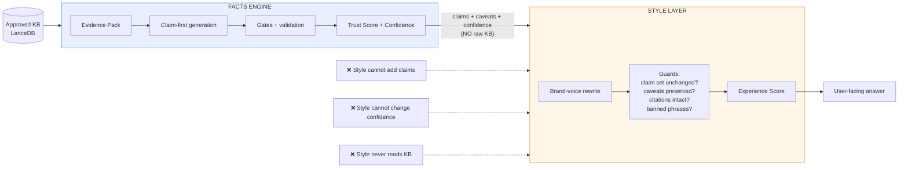
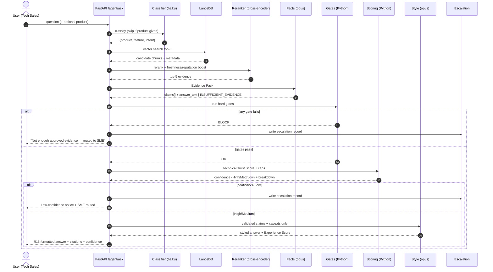
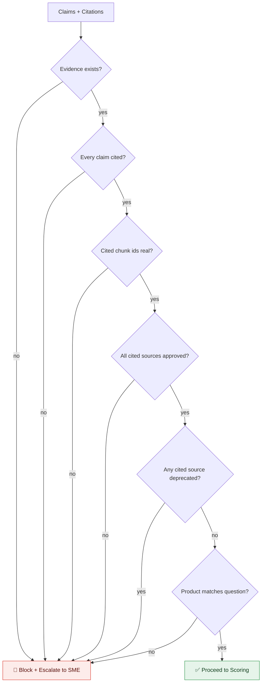
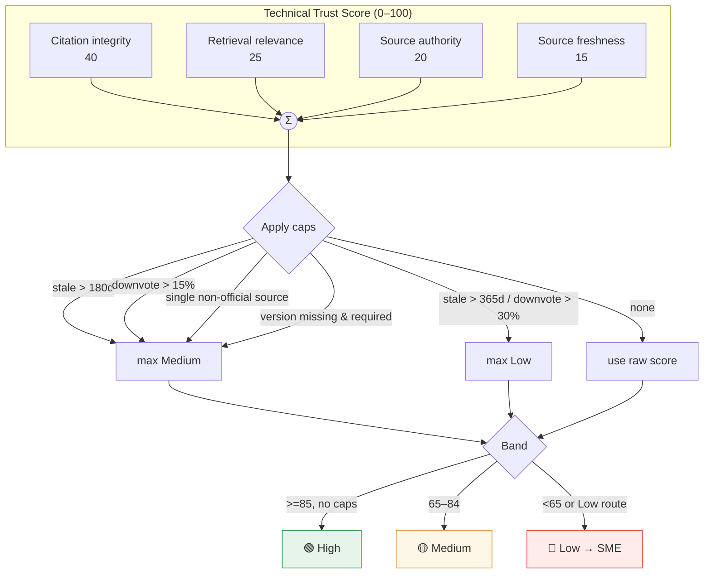
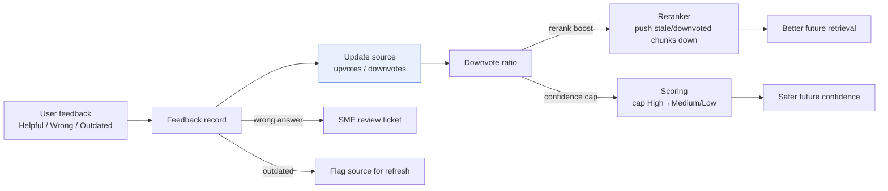
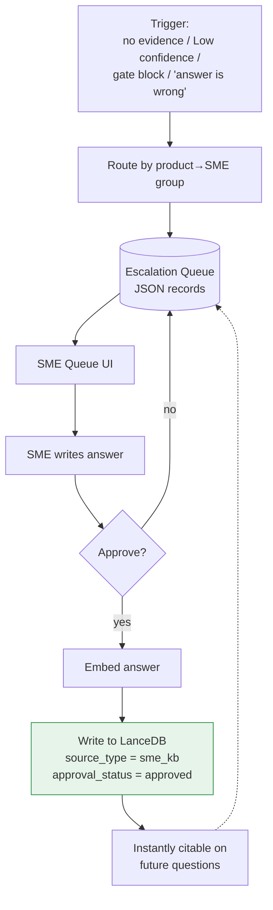
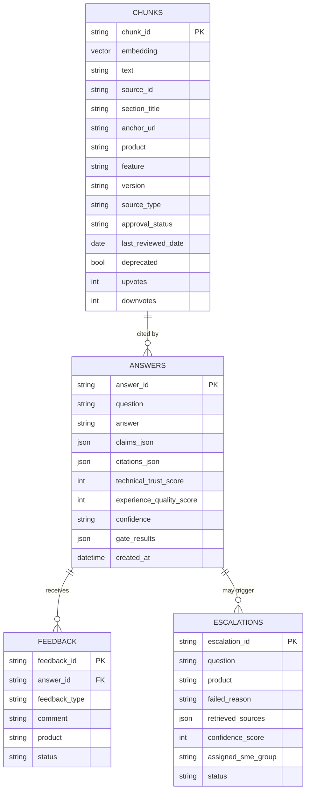
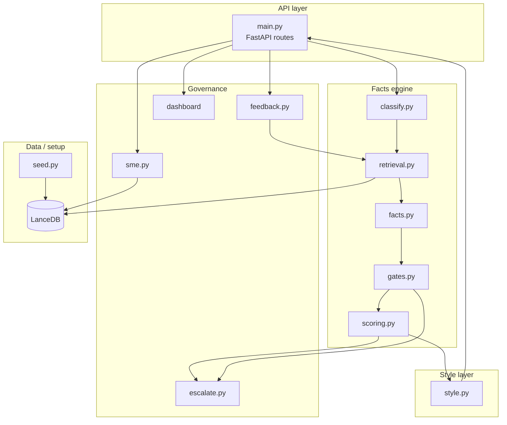

# Evidence-Governed Knowledge Agent — MVP Architecture

An evidence-governed RAG agent for Technical Sales. It answers product questions
**only** from approved sources, cites every factual claim, computes a
**deterministic** confidence score, and escalates weak/missing evidence to SMEs.

**Stack:** Python · FastAPI · LanceDB (vectors + metadata + built-in local
cross-encoder reranker) · Claude (`claude-haiku-4-5` classify, `claude-opus-4-8`
facts + style) · feedback → reputation → rerank (**no retraining**).

**Core principle — a hard wall between Facts and Style:** the model that touches
evidence never styles; the model that styles never touches raw evidence. Brand
voice can raise the Experience score but can **never** change the Technical Trust
Score or confidence.

---

## 1. High-Level Architecture

```mermaid
flowchart TD
    Q[User Question] --> CLS[Classify<br/>product / feature / intent<br/>haiku]

    subgraph FACTS["🔒 FACTS ENGINE — touches evidence"]
        direction TB
        CLS --> RET[Retrieve<br/>LanceDB vector search top-K]
        RET --> RR[Rerank<br/>cross-encoder + freshness/reputation boost]
        RR --> EP[Evidence Pack<br/>question + chunk text + ids only]
        EP --> GEN[Claim-first Answer<br/>opus → claims[] + answer_text]
        GEN --> GATE[Gates + Citation Validation<br/>pure Python]
        GATE --> SCORE[Technical Trust Score<br/>+ confidence + caps]
    end

    SCORE -->|validated claims + caveats only| STYLE

    subgraph STYLEBOX["🎨 STYLE LAYER — never sees raw KB"]
        direction TB
        STYLE[Brand-voice Rewrite<br/>opus] --> GUARD[Style Guards<br/>no new claims / no dropped caveats<br/>citations intact / banned-phrase]
        GUARD --> EXP[Experience Quality Score]
    end

    EXP --> DEC{Confidence?}
    DEC -->|High / Medium| ANS[Final Answer<br/>§16 format]
    DEC -->|Low / blocked| ESC[SME Escalation]

    ANS --> FB[Feedback]
    ESC --> SMEQ[SME Queue]
    SMEQ --> PUB[Approve → Publish<br/>back into LanceDB as approved source]
    PUB -.new approved chunk.-> RET

    FB --> REP[Update source reputation<br/>upvotes / downvotes]
    REP -.rerank boost.-> RR
    REP -.confidence cap.-> SCORE

    classDef facts fill:#e8f0fe,stroke:#3367d6,color:#0b2a6b;
    classDef style fill:#fef7e8,stroke:#d68a33,color:#6b450b;
    class FACTS facts;
    class STYLEBOX style;
```

---

## 2. The Facts / Style Wall

The single most important design constraint. Evidence flows **one way**: from the
Facts engine into the Style layer as already-validated claims. Style output is
re-checked to guarantee it added nothing and removed no caveats.



---

## 3. `/agent/ask` Request Sequence



---

## 4. Hard Gates (No Citation, No Answer)

All deterministic, pure Python — runs **before** scoring. Any failure blocks the
answer and routes to SME.



---

## 5. Technical Trust Score & Confidence

Score is **calculated, not generated by the LLM**. Caps can pull a numerically
high score down to Medium/Low.



---

## 6. Feedback → Reputation → Rerank Loop (No Retraining)

User feedback updates a per-source reputation signal that feeds **two** places:
the reranker (ordering) and the confidence cap. No model is retrained.



---

## 7. SME Escalation & Publish Loop (Light Lifecycle)



> MVP skips the full Draft → Reviewed → Periodic-review lifecycle. Just:
> **queue → SME answer → approve → publish.**

---

## 8. Data Model

LanceDB holds vectors **and** metadata in one `chunks` table (source-level fields
ride on the chunk for MVP). Audit lives in an `answers` table; feedback and
escalations are JSON files the dashboard reads.



---

## 9. Module Map



---

## 10. Build Order

```mermaid
flowchart LR
    S1[1. Skeleton] --> S2[2. seed.py]
    S2 --> S3[3. retrieval.py]
    S3 --> S5[5. facts.py]
    S5 --> S6[6. gates.py]
    S6 --> S7[7. scoring.py]
    S7 --> S12[12. main.py<br/>/agent/ask runnable]
    S12 --> S8[8. style.py]
    S8 --> S9[9-10. escalate + feedback]
    S9 --> S11[11. SME publish]
    S11 --> S13[13-14. dashboard + UI]

    style S12 fill:#e6f4ea,stroke:#1e8e3e
```



**Fastest proof:** `1 → 2 → 3 → 5 → 6 → 7 → 12` gives a working cited answer with
deterministic confidence over the API. Then layer style, governance, and UI.

---

## 11. Scope Summary

| In (MVP core) | Deferred / Out |
| --- | --- |
| LanceDB retrieval + cross-encoder rerank | Web/PDF ingestion pipeline |
| Facts engine: claim-first + gates + Trust Score | Conflict-with-newer-source check |
| Style layer: brand voice + guards + Experience Score | Full 100-pt 7-category scorer |
| Confidence bands + caps | Reranker training / model retraining |
| Feedback → reputation → rerank + cap | Slack/Jira/ServiceNow integrations |
| SME light queue → approve → publish | Full SME lifecycle (draft/review states) |
| Light read-only dashboard | Heavy analytics stack |
